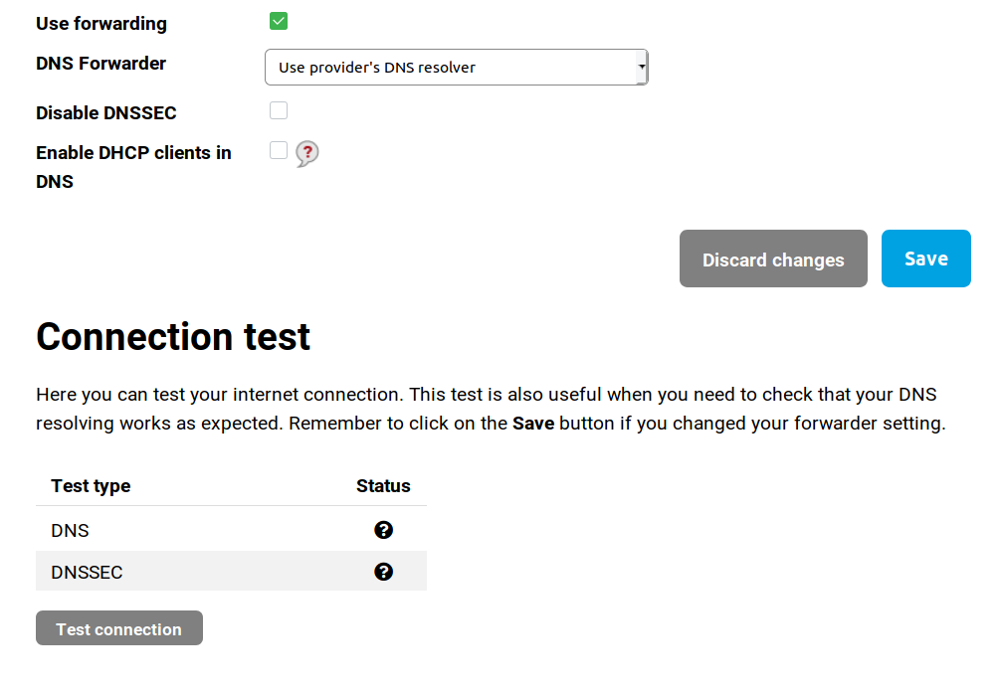

## DNS

The Turris router uses its own DNS resolver with DNSSEC support. It is able to work as a completely independent resolver or with the help of ISP's DNS resolver which is the target of the so-called forwarding. Where the ISP's resolver works correctly, it is preferred to use the forwarding mode which usually yields better response times. If this mode does not work in your network, you have to disable the forwarding mode. Forwarding can be broken in cases when your ISP does not support DNSSEC and has incorrectly configured servers.

Turris allows you to disable the DNSSEC validation. We highly recommend you not to do so, since you can easily become a target of a DNS spoofing attack then.

The connectivity test is used to test the individual components of your connection and includes, among other things, a test of the DNS itself and DNSSEC security. You can also use this test to verify forwarding settings.

