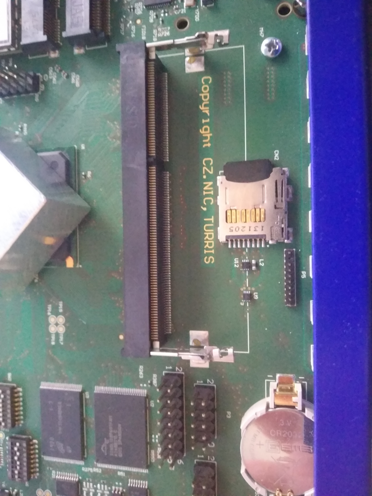

# Btrfs migration on Turris 1.x routers

!!! warning
    This article is for [Turris 1.x routers](../hw/turris-1x/turris-1x.md)
    running on old [Turris OS 3.x](../basics/tos-versions.md) version.
    It's intention is to make it possible to easilly use the latest major version
    of Turris OS version.

Btrfs is default filesystem on Turris Omnia and Turris MOX while Turris 1.x
routers were using at first JFFS2 and these days UBIFS.  In recent versions, we
added the possibility to use Btrfs file system for our first routers. It has
various advantages like providing backups via snapshots by using tool
[Schnapps](../geek/schnapps/schnapps.md) for managing snapshots. However, while
you can use RESET button to rollback to previous snapshots on Turris Omnia, this
is not possible on Turris 1.x routers, yet.

## Requirements

You will need:

* [Turris 1.0 or Turris 1.1](../hw/turris-1x/turris-1x.md) router
* microSD card with at least 4 GB free storage
* screwdriver

### Preparation of Turris 1.0 routers

!!! warning
    You should be using UBIFS before you can proceed.

All Turris 1.0 routers comes by default with JFFS2 and this can be checked with
command `mount` or in the advanced administration LuCI.  In Turris OS 3.10.9,
which we released at end the of the year 2018, we automatically updated the
operating system located in NOR. It means that if you did a Factory Reset
afterwards, you should be running Turris OS 3.8.5 and if you were using JFFS2
before, you will switch to UBIFS just by resetting to factory settings.

### Inserting microSD card

You will need to unplug the router from the power supply. You need to unscrew a
few screws from the top cover of the router to remove it. microSD card slot is
located underneath the RAM slot. Very cautiously remove RAM from its slot by
pressing clips on both sides and RAM should pop out itself. Then you can insert
the microSD card slowly and without using force.


If the card is in it is place, you can now put back the RAM, top cover and plug the power
cord into the router.



### Installing package

Before you are able to install any packages using LuCI/SSH, you need to update
package lists and then you can install package `turris-btrfs`.

```
opkg update
opkg install turris-btrfs
```

It does nothing by itself, so it is safe to install.

#### Formatting microSD card

Next step is to execute the `btrfs_migrate` command, which is a script that will
make sure that you want to really want to wipe all the data on microSD card and
afterward it will format the card to Btrfs. Then it will copy all the current content on
the NAND (internal storage) to microSD card and set U-boot environment to boot
from microSD card.

After script is done, you will get a notification to reboot your router.

To check if you are booting from microSD card, you can run the command `mount |
grep btrfs` to verify that there is something like `/dev/mmcblk0p2 on / **type
btrfs**`. If it is there, migration was successful.

### When happens if you remove the microSD card

Turris boots from the NAND (internal storage) in the same state as before
migration.

### How to use Turris OS 5.x

As for now, there is disabled opt-in migration for Turris 1.x routers, however
there is a way how to switch to the latest major version.

!!! warning
    By following this 5.x migration howto, you will loose your current settings 
    and will have to configure everything from scratch.

If you will run one by the following commands, it will download medkit from the
[HBS branch](../geek/testing.md), import the medkit as the factory snapshot and
reset to factory defaults using the latest version of Turris OS. Reboot will do
its thing that you will boot from the factory image.

```
cd /tmp
wget https://repo.turris.cz/hbs/medkit/turris1x-medkit-latest.tar.gz
schnapps import -f turris1x-medkit-*.tar.gz
schnapps rollback factory
reboot
```
